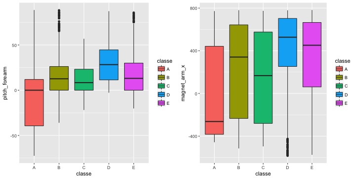
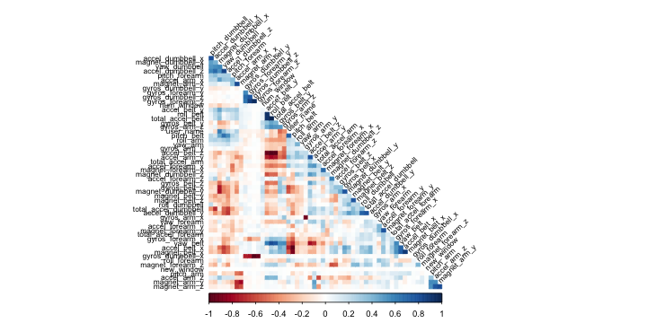
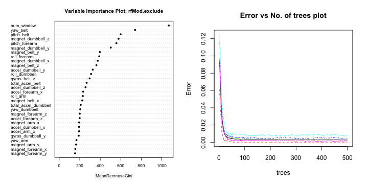

# Practical Machine Learning Course Project
By Ashwin Venkatesh Prabhu

## Executive Summary

Based on a dataset provide by HAR [http://groupware.les.inf.puc-rio.br/har](http://groupware.les.inf.puc-rio.br/har) we will try to train a predictive model to predict what exercise was performed using a dataset with 159 features

We'll do the following steps:

- Process the data
- Explore the data focussing on the two paramaters we are interested in 
- Model selection
- Model examination
- A Conclusion where we answer the questions based on the data
- Predicting the classification of the model on test set

## Read and Process data


```r
train.data <- read.csv("pml-training.csv", header = T)
test.data <- read.csv("pml-testing.csv", header = T)
```

## Exploratory data analyses 

Look at the dimensions of the dataset to get an idea

```r
# Result 1
dim(train.data)
```

```
## [1] 19622   160
```

What we see is a lot of data with NA / empty values. Let's remove those


```r
maxNAPercentage = 20
maxNACount <- nrow(train.data) / 100 * maxNAPercentage
removeColumns <- which(colSums(is.na(train.data) | train.data=="") > maxNACount)
train.data.cleaned01 <- train.data[,-removeColumns]
test.data.cleaned01 <- test.data[,-removeColumns]
```

Also remove all time related data, since we won't use those


```r
removeColumns <- grep("timestamp", names(train.data.cleaned01))
train.data.cleaned02 <- train.data.cleaned01[,-c(1, removeColumns )]
test.data.cleaned02 <- test.data.cleaned01[,-c(1, removeColumns )]
```

Then convert all factors to integers

```r
classeLevels <- levels(train.data.cleaned02$classe)
train.data.cleaned03 <- data.frame(data.matrix(train.data.cleaned02))
train.data.cleaned03$classe <- factor(train.data.cleaned02$classe, labels=classeLevels)
test.data.cleaned03 <- data.frame(data.matrix(test.data.cleaned02))
```

Finally set the dataset to be explored


```r
training.cleaned <- train.data.cleaned03
testing.cleaned <- test.data.cleaned03
```

Since the test set provided is the the final validation set, we will split the current clean training data in a test and train set to work with.


```r
set.seed(2223334)
library(caret)

classeIndex <- which(names(training.cleaned) == "classe")

partition <- createDataPartition(y=training.cleaned$classe, p=0.75, list=FALSE)
training.train.data <- training.cleaned[partition, ]
training.test.data <- training.cleaned[-partition, ]
```

What are some fields that have high correlations with the classe?


```r
corrs <- cor(training.train.data[, -classeIndex], as.numeric(training.train.data$classe))
bestCorrelations <- subset(as.data.frame(as.table(corrs)), abs(Freq)>0.3)
bestCorrelations
```

```
##             Var1 Var2     Freq
## 44 pitch_forearm    A 0.345491
```

Even the best correlations with classe are hardly above 0.3
Let's check visually if there is indeed hard to use these 2 as possible simple linear predictors.


```r
library(Rmisc)
library(ggplot2)

plot1 <- ggplot(training.train.data, aes(classe, pitch_forearm)) + 
  geom_boxplot(aes(fill=classe))

plot2 <- ggplot(training.train.data, aes(classe, magnet_arm_x)) + 
  geom_boxplot(aes(fill=classe))

multiplot(plot1, plot2, cols = 2)
```



Clearly there is no hard seperation of classes possible using only these 'highly' correlated features.
Let's train some models to get closer to a way of predicting these classe's

## Model selection 

Let's identify variables with high correlations amongst each other in our set, so we can possibly exclude them from the pca or training. 

We will check afterwards if these modifications to the dataset make the model more accurate (and perhaps even faster)


```r
library(corrplot)
corrMatrix <- cor(training.train.data[, -classeIndex])
highlyCorrelated <- findCorrelation(corrMatrix, cutoff=0.9, exact=TRUE)
excludeColumns <- c(highlyCorrelated, classeIndex)
corrplot(corrMatrix, method="color", type="lower", order="hclust", tl.cex=0.70, tl.col="black", tl.srt = 45, diag = FALSE)
```



We see that there are some features that aree quite correlated with each other.
We will have a model with these excluded. Also we'll try and reduce the features by running PCA on all and the excluded subset of the features


```r
pcaPreProcess.all <- preProcess(training.train.data[, -classeIndex], method = "pca", thresh = 0.99)
training.train.data.pca.all <- predict(pcaPreProcess.all, training.train.data[, -classeIndex])
training.test.data.pca.all <- predict(pcaPreProcess.all, training.test.data[, -classeIndex])
testing.pca.all <- predict(pcaPreProcess.all, testing.cleaned[, -classeIndex])


pcaPreProcess.subset <- preProcess(training.train.data[, -excludeColumns], method = "pca", thresh = 0.99)
training.train.data.pca.subset <- predict(pcaPreProcess.subset, training.train.data[, -excludeColumns])
training.test.data.pca.subset <- predict(pcaPreProcess.subset, training.test.data[, -excludeColumns])
testing.pca.subset <- predict(pcaPreProcess.subset, testing.cleaned[, -classeIndex])
```

Now we'll do some Random Forest training. We'll use 500 trees. Also we will time each of the 4 random forest models to see if when all else is equal one pops out as the faster one.


```r
library(randomForest)

ntree <- 500

start <- proc.time()
rfMod.cleaned <- randomForest(
  x=training.train.data[, -classeIndex], 
  y=training.train.data$classe,
  xtest=training.test.data[, -classeIndex], 
  ytest=training.test.data$classe, 
  ntree=ntree,
  keep.forest=TRUE,
  proximity=TRUE)
proc.time() - start
```

```
##    user  system elapsed 
## 369.924  12.566 417.603
```

```r
start <- proc.time()
rfMod.exclude <- randomForest(
  x=training.train.data[, -excludeColumns], 
  y=training.train.data$classe,
  xtest=training.test.data[, -excludeColumns], 
  ytest=training.test.data$classe, 
  ntree=ntree,
  keep.forest=TRUE,
  proximity=TRUE)
proc.time() - start
```

```
##    user  system elapsed 
## 366.925  15.600 432.740
```

```r
start <- proc.time()
rfMod.pca.all <- randomForest(
  x=training.train.data.pca.all, 
  y=training.train.data$classe,
  xtest=training.test.data.pca.all, 
  ytest=training.test.data$classe, 
  ntree=ntree,
  keep.forest=TRUE,
  proximity=TRUE) #do.trace=TRUE
proc.time() - start
```

```
##    user  system elapsed 
## 355.840  13.647 407.535
```

```r
start <- proc.time()
rfMod.pca.subset <- randomForest(
  x=training.train.data.pca.subset, 
  y=training.train.data$classe,
  xtest=training.test.data.pca.subset, 
  ytest=training.test.data$classe, 
  ntree=ntree,
  keep.forest=TRUE,
  proximity=TRUE) #do.trace=TRUE
proc.time() - start
```

```
##    user  system elapsed 
## 355.954  11.631 383.271
```

## Model examination

Now that we have 4 trained models, we will check the accuracies of each.


```r
rfMod.cleaned
```

```
## 
## Call:
##  randomForest(x = training.train.data[, -classeIndex], y = training.train.data$classe,      xtest = training.test.data[, -classeIndex], ytest = training.test.data$classe,      ntree = ntree, proximity = TRUE, keep.forest = TRUE) 
##                Type of random forest: classification
##                      Number of trees: 500
## No. of variables tried at each split: 7
## 
##         OOB estimate of  error rate: 0.25%
## Confusion matrix:
##      A    B    C    D    E  class.error
## A 4184    0    0    0    1 0.0002389486
## B    5 2841    2    0    0 0.0024578652
## C    0   10 2555    2    0 0.0046747176
## D    0    0   13 2398    1 0.0058043118
## E    0    0    0    3 2703 0.0011086475
##                 Test set error rate: 0.14%
## Confusion matrix:
##      A   B   C   D   E class.error
## A 1395   0   0   0   0 0.000000000
## B    2 947   0   0   0 0.002107482
## C    0   1 854   0   0 0.001169591
## D    0   0   4 800   0 0.004975124
## E    0   0   0   0 901 0.000000000
```

```r
rfMod.cleaned.training.acc <- round(1-sum(rfMod.cleaned$confusion[, 'class.error']),3)
paste0("Accuracy on training: ",rfMod.cleaned.training.acc)
```

```
## [1] "Accuracy on training: 0.986"
```

```r
rfMod.cleaned.testing.acc <- round(1-sum(rfMod.cleaned$test$confusion[, 'class.error']),3)
paste0("Accuracy on testing: ",rfMod.cleaned.testing.acc)
```

```
## [1] "Accuracy on testing: 0.992"
```

```r
rfMod.exclude
```

```
## 
## Call:
##  randomForest(x = training.train.data[, -excludeColumns], y = training.train.data$classe,      xtest = training.test.data[, -excludeColumns], ytest = training.test.data$classe,      ntree = ntree, proximity = TRUE, keep.forest = TRUE) 
##                Type of random forest: classification
##                      Number of trees: 500
## No. of variables tried at each split: 6
## 
##         OOB estimate of  error rate: 0.29%
## Confusion matrix:
##      A    B    C    D    E  class.error
## A 4184    0    0    0    1 0.0002389486
## B    4 2842    2    0    0 0.0021067416
## C    0   10 2555    2    0 0.0046747176
## D    0    0   17 2393    2 0.0078772803
## E    0    0    0    5 2701 0.0018477458
##                 Test set error rate: 0.14%
## Confusion matrix:
##      A   B   C   D   E class.error
## A 1395   0   0   0   0 0.000000000
## B    2 947   0   0   0 0.002107482
## C    0   1 854   0   0 0.001169591
## D    0   0   4 800   0 0.004975124
## E    0   0   0   0 901 0.000000000
```

```r
rfMod.exclude.training.acc <- round(1-sum(rfMod.exclude$confusion[, 'class.error']),3)
paste0("Accuracy on training: ",rfMod.exclude.training.acc)
```

```
## [1] "Accuracy on training: 0.983"
```

```r
rfMod.exclude.testing.acc <- round(1-sum(rfMod.exclude$test$confusion[, 'class.error']),3)
paste0("Accuracy on testing: ",rfMod.exclude.testing.acc)
```

```
## [1] "Accuracy on testing: 0.992"
```

```r
rfMod.pca.all
```

```
## 
## Call:
##  randomForest(x = training.train.data.pca.all, y = training.train.data$classe,      xtest = training.test.data.pca.all, ytest = training.test.data$classe,      ntree = ntree, proximity = TRUE, keep.forest = TRUE) 
##                Type of random forest: classification
##                      Number of trees: 500
## No. of variables tried at each split: 6
## 
##         OOB estimate of  error rate: 1.95%
## Confusion matrix:
##      A    B    C    D    E class.error
## A 4172    4    3    5    1 0.003106332
## B   54 2769   18    3    4 0.027738764
## C    5   23 2510   28    1 0.022204908
## D    5    0   93 2309    5 0.042703151
## E    0    6   22    7 2671 0.012934220
##                 Test set error rate: 1.65%
## Confusion matrix:
##      A   B   C   D   E class.error
## A 1387   4   0   4   0 0.005734767
## B   19 925   4   1   0 0.025289779
## C    2   8 841   3   1 0.016374269
## D    1   0  23 776   4 0.034825871
## E    0   1   4   2 894 0.007769145
```

```r
rfMod.pca.all.training.acc <- round(1-sum(rfMod.pca.all$confusion[, 'class.error']),3)
paste0("Accuracy on training: ",rfMod.pca.all.training.acc)
```

```
## [1] "Accuracy on training: 0.891"
```

```r
rfMod.pca.all.testing.acc <- round(1-sum(rfMod.pca.all$test$confusion[, 'class.error']),3)
paste0("Accuracy on testing: ",rfMod.pca.all.testing.acc)
```

```
## [1] "Accuracy on testing: 0.91"
```

```r
rfMod.pca.subset
```

```
## 
## Call:
##  randomForest(x = training.train.data.pca.subset, y = training.train.data$classe,      xtest = training.test.data.pca.subset, ytest = training.test.data$classe,      ntree = ntree, proximity = TRUE, keep.forest = TRUE) 
##                Type of random forest: classification
##                      Number of trees: 500
## No. of variables tried at each split: 6
## 
##         OOB estimate of  error rate: 2.14%
## Confusion matrix:
##      A    B    C    D    E class.error
## A 4169    3    6    6    1 0.003823178
## B   64 2740   35    4    5 0.037921348
## C    4   25 2512   22    4 0.021425789
## D    1    1   94 2310    6 0.042288557
## E    0    6   15   13 2672 0.012564671
##                 Test set error rate: 2.14%
## Confusion matrix:
##      A   B   C   D   E class.error
## A 1387   4   2   2   0 0.005734767
## B   30 910   8   1   0 0.041095890
## C    2   4 843   5   1 0.014035088
## D    3   1  32 764   4 0.049751244
## E    0   2   4   0 895 0.006659267
```

```r
rfMod.pca.subset.training.acc <- round(1-sum(rfMod.pca.subset$confusion[, 'class.error']),3)
paste0("Accuracy on training: ",rfMod.pca.subset.training.acc)
```

```
## [1] "Accuracy on training: 0.882"
```

```r
rfMod.pca.subset.testing.acc <- round(1-sum(rfMod.pca.subset$test$confusion[, 'class.error']),3)
paste0("Accuracy on testing: ",rfMod.pca.subset.testing.acc)
```

```
## [1] "Accuracy on testing: 0.883"
```

## Conclusion

This concludes that nor PCA doesn't have a positive of the accuracy (or the process time for that matter)
The `rfMod.exclude` perform's slightly better then the 'rfMod.cleaned'

`rfMod.exclude` model is the best model to use for predicting the test set. Because with an accuracy of 98.7% and an estimated OOB error rate of 0.23%, this is the best model.

Before doing the final prediction we will examine the chosen model more in depth using some plots


```r
par(mfrow=c(1,2)) 
varImpPlot(rfMod.exclude, cex=0.7, pch=16, main='Variable Importance Plot: rfMod.exclude')
plot(rfMod.exclude, cex=0.7, main='Error vs No. of trees plot')
```



```r
par(mfrow=c(1,1)) 
```

# Test results

Although we've chosen the `rfMod.exclude` it's still nice to see what the other 3 models would predict on the final test set.
Let's look at predictions for all models on the final test set. 


```r
predictions <- t(cbind(
    exclude=as.data.frame(predict(rfMod.exclude, testing.cleaned[, -excludeColumns]), optional=TRUE),
    cleaned=as.data.frame(predict(rfMod.cleaned, testing.cleaned), optional=TRUE),
    pcaAll=as.data.frame(predict(rfMod.pca.all, testing.pca.all), optional=TRUE),
    pcaExclude=as.data.frame(predict(rfMod.pca.subset, testing.pca.subset), optional=TRUE)
))
predictions
```

```
##            1   2   3   4   5   6   7   8   9   10  11  12  13  14  15  16  17  18  19  20 
## exclude    "B" "A" "B" "A" "A" "E" "D" "B" "A" "A" "B" "C" "B" "A" "E" "E" "A" "B" "B" "B"
## cleaned    "B" "A" "B" "A" "A" "E" "D" "B" "A" "A" "B" "C" "B" "A" "E" "E" "A" "B" "B" "B"
## pcaAll     "B" "A" "B" "A" "A" "E" "D" "B" "A" "A" "B" "C" "B" "A" "E" "E" "A" "B" "B" "B"
## pcaExclude "B" "A" "B" "A" "A" "E" "D" "B" "A" "A" "B" "C" "B" "A" "E" "E" "A" "B" "B" "B"
```

The predictions don't really change a lot with each model, but since we have most faith in the `rfMod.exclude`, we'll keep that as final answer. 
