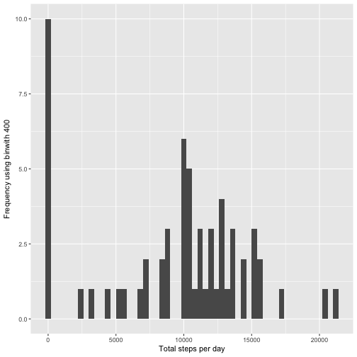
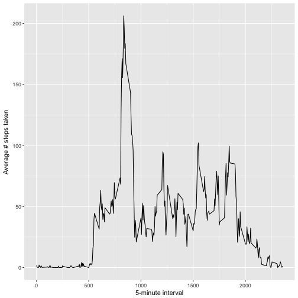
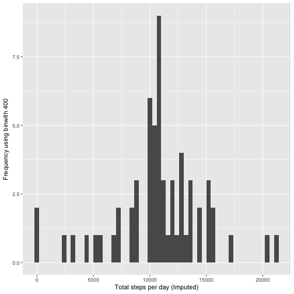
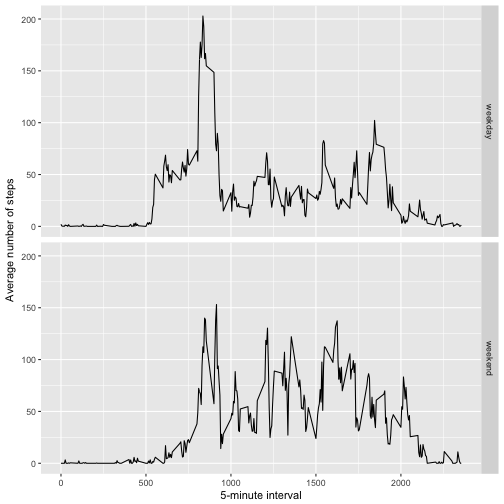

# Reproducible Research - Peer Assignment 1, Week 2


```r
library(Hmisc)
library(ggplot2)
library(scales)
```

## Loading and preprocessing the data


```r
## Load data
data <- read.csv("activity.csv")
summary(data)
```

```
##      steps                date          interval     
##  Min.   :  0.00   2012-10-01:  288   Min.   :   0.0  
##  1st Qu.:  0.00   2012-10-02:  288   1st Qu.: 588.8  
##  Median :  0.00   2012-10-03:  288   Median :1177.5  
##  Mean   : 37.38   2012-10-04:  288   Mean   :1177.5  
##  3rd Qu.: 12.00   2012-10-05:  288   3rd Qu.:1766.2  
##  Max.   :806.00   2012-10-06:  288   Max.   :2355.0  
##  NA's   :2304     (Other)   :15840
```

## What is mean total number of steps taken per day?


```r
stepsbyday <- tapply(data$steps, data$date, sum, na.rm = T)

## Histogram depicting total number of steps taken each day
qplot(stepsbyday, xlab='Total steps per day', ylab='Frequency using binwith 400', binwidth=400)
```



```r
mean(stepsbyday, na.rm = T)
```

[1] 9354.23

```r
median(stepsbyday, na.rm = T)
```

[1] 10395

## What is the average daily activity pattern?


```r
avgstepstimeblock <- aggregate(x=list(meanSteps = data$steps), by=list(interval=data$interval), FUN=mean, na.rm=TRUE)

## Time series plot
ggplot(data=avgstepstimeblock, aes(x=interval, y=meanSteps)) +
    geom_line() +
    xlab("5-minute interval") +
    ylab("Average # steps taken")
```



```r
## Which 5-minute interval, on average across all the days in the dataset, contains the maximum number of steps
mostSteps <- which.max(avgstepstimeblock$meanSteps)
timeMostSteps <- gsub("([0-9]{1,2})([0-9]{2})", "\\1:\\2", avgstepstimeblock[mostSteps,'interval'])
timeMostSteps
```

[1] "8:35"

## Imputing missing values


```r
## Find the number of missing values in the data
missing <- length(which(is.na(data$steps)))
missing
```

[1] 2304

```r
## Impute the missing values
imputed.data <- data
imputed.data$steps <- impute(data$steps, fun = mean)
```


```r
## Calculate the steps taken per day
stepsbydayImputed <- tapply(imputed.data$steps, imputed.data$date, sum)

## A histogram depicting the total number of steps taken in a day
qplot(stepsbydayImputed, xlab = 'Total steps per day (Imputed)', ylab='Frequency using binwith 400', binwidth=400)
```



```r
## Calculate the mean and median of the steps taken per day in the imputed data
stepsbydayImputed <- tapply(imputed.data$steps, imputed.data$date, FUN = sum)
mean(stepsbydayImputed)
```

[1] 10766.19

```r
median(stepsbydayImputed)
```

[1] 10766.19

## Are there differences in activity patterns between weekdays and weekends?

```r
imputed.data$dateType <- ifelse(as.POSIXlt(imputed.data$date)$wday %in% c(0,6), 'weekend', 'weekday')

avgActivity <- aggregate(steps ~ interval + dateType, data=imputed.data, mean)
ggplot(avgActivity, aes(interval, steps)) + 
    geom_line() + 
    facet_grid(dateType ~ .) +
    xlab("5-minute interval") + 
    ylab("Average number of steps")
```


